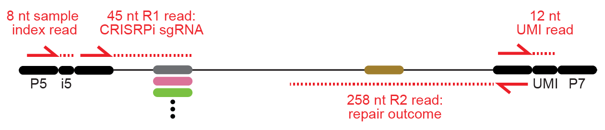

# processing, analysis, and visualization of data from [Repair-seq screens](https://seq.repair)

Table of Contents
-----------------

* [Installation](#Installation)
    * [Using pip](#Using-pip)
* [Analyzing publicly-available data](#Analyzing-publicly-available-data)
    1. [Setting up metadata and reference genomes](#Setting-up-metadata-and-reference-genomes)
    1. [Downloading sequencing data from SRA](#Downloading-sequencing-data-from-SRA)
    1. [Processing sequencing data](#Processing-sequencing-data)

Installation
------------
### Using pip

```
pip install repair-seq
```

## Analyzing publicly-available data

This tutorial will walk through processing of data from [Hussmann, ..., Adamson, *Cell* (2021)](https://www.sciencedirect.com/science/article/pii/S0092867421011764).


### Setting up metadata and reference genomes

First, create a project directory BASE_DIR that will hold all input data, references sequences, and analysis output. Then run:

`$ repair-seq SRA initial_setup BASE_DIR`

This will move annotations of the screen vector and CRISPRI sgRNA libraries into BASE_DIR, build sgRNA-specific versions of the screen vector, download reference genomes, and build corresponding alignment indices.

### Downloading sequencing data from SRA

To download raw sequencing data for an individual screen, run

`$ repair-seq SRA download BASE_DIR SCREEN_NAME`

Experimental details for each screen are listed in [Table S5](https://ars.els-cdn.com/content/image/1-s2.0-S0092867421011764-mmc5.xlsx). Valid options for `SCREEN_NAME` are value from the `Screen_Name` column in this table.

Note that four sequencing reads per spot were used in these screens: an 8 nt sample index read, a 12 nt UMI, a 45 nt read to identify the CRISPRi sgRNA identity, and a 258 nt read to identify the repair outcome sequence:



For convenience/compatibility with SRA, the data on SRA consists of only R1 and R2 files. This data has been demultiplexed into individual screens based on the sample index read, and the UMI sequence and quality scores for each spot have been appended onto the query names of the R1 and R2 reads, separated by underscores:

```
$ zcat K562_SpCas9_target-1_none_AX227_1_R1.fastq.gz | head -n 4
@01:01101:001362:001000_GTCAGTACAAGT_FFFFFFFFFFF:
NATCCCTTGGAGAACCACCTTGTTGGTTTCTCCGGCAGCAGAAAG
+
#FFFFFFFFFFFFFFFFFFFFFFFFFFFFFFFFFFFFFFFFFFFF

$ zcat K562_SpCas9_target-1_none_AX227_1_R2.fastq.gz | head -n 4
@01:01101:001362:001000_GTCAGTACAAGT_FFFFFFFFFFF:
NGCCGCTGCACGTAGCATGCAACAAAGGAACCTTTAATAGAAATTGGACAGCAAGAAAGCGAGCTTAGTGATACTTGTGGGCCAGGGCAT...
+
#FFFFFFFFFFFFFFFFFFFFFFFFFFFFFFFFFFFFFFFFFFFFFFFFFFFFFFFFFFFFFFFFFFFFFFFFFFFFFFFFFFFFFFFFF...
```

### Processing sequencing data

To process data for an individual screen after downloading it,

`repair-seq SRA process BASE_DIR SCREEN_NAME`

This will demultplex reads based on the CRISPRi sgRNA identities in R1 reads, collapse and error-correct resulting groups of R2 sequences based on their UMI sequences, align and categorize these error-corrected sequences, and count the CRISPRi-sgRNA-specific frequencies of each identified repair outcome.